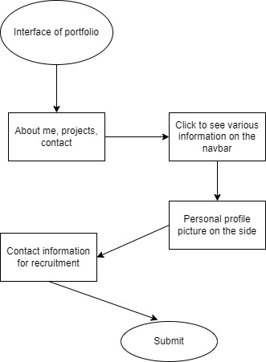

# PROJECT OVERVIEW
- This is a personal portfolio project
- The main aim of this project is to showcase some personal information and some projects I've done so far and my   contact information

# FEATURES AND FUNCTIONALITY
- Features
    - Sections which contains my profile such as 
        - About me
        - Personal Projects links
        - Contact information

- Functionality
    - Users can get access to personal projects when they click the link provided
    - Users or recruiters can reach out to me using a provided contact form

# TECHNOLOGIES USED:
- HTML
- CSS
- Python(Flask)

# SCREENSHOTS OR DEMO

- Flowchart: 

# ROADMAP AND FUTURE ENHANCEMENTS
- - Building more projects to add to the portfolio

# CONTACT INFORMATION
- Name: Emmanuel Danso
- Projects:
    - [stopwatch](https://github.com/EmmanuelDanso1/frontend_projects/tree/main/Stopwatch)
    - [image_search_site](https://github.com/EmmanuelDanso1/frontend_projects/tree/main/Image_Search_app)
- Social Media Profiles
    - Twitter: [twitter](@BraEmma84)
    - Github: [github](https://github.com/EmmanuelDanso1)
    - LinkedIn: [linkedin](https://www.linkedin.com/in/emmanuel-danso-862566249/)
- Phone: +233544638351
- Email: kwekudanso21@gmail.com